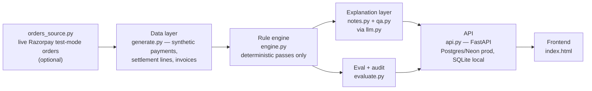
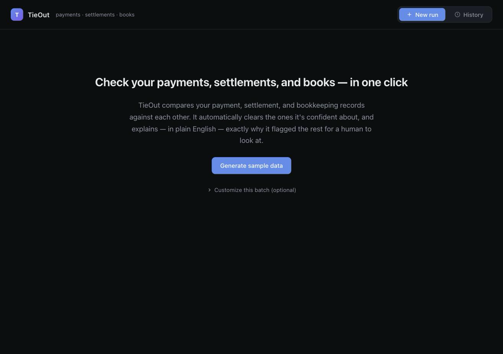
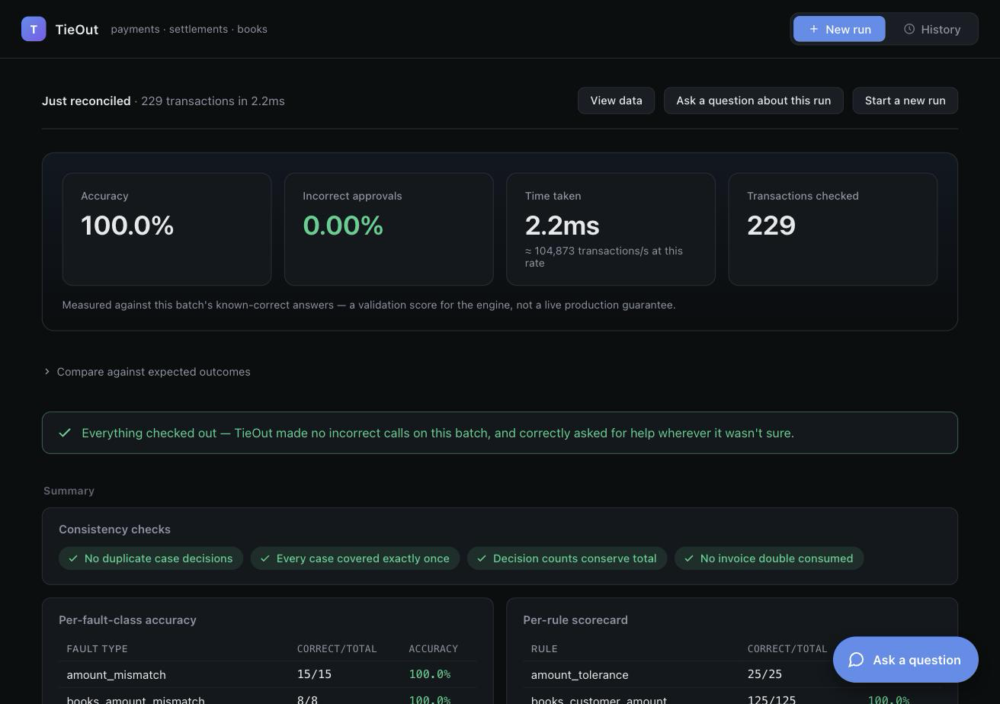
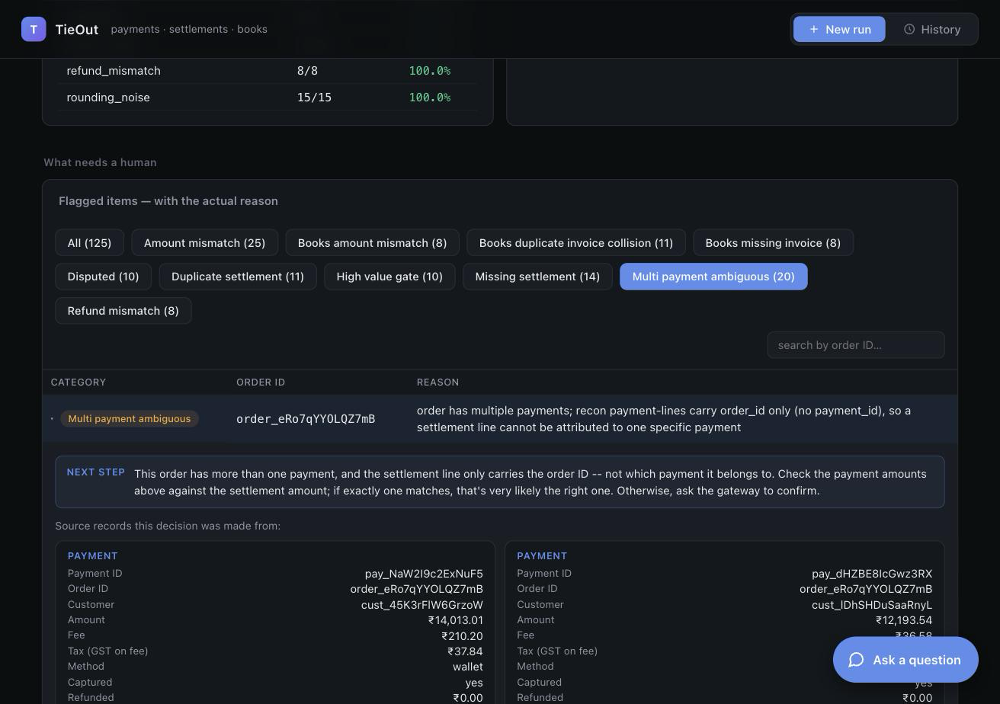
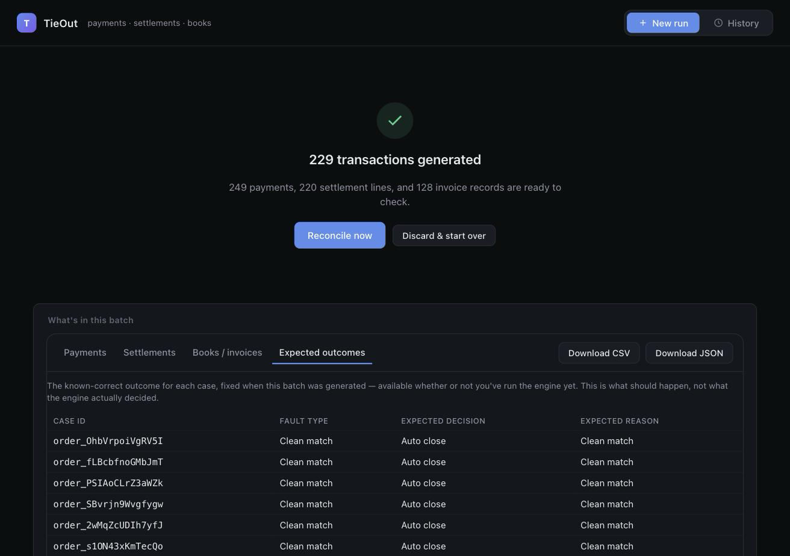
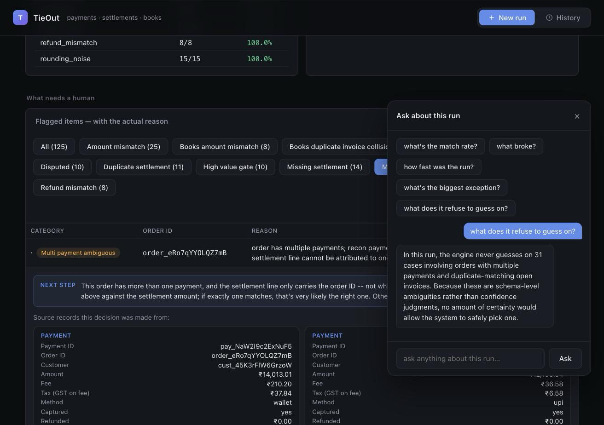

# TieOut

**A merchant's money moves through three systems that are supposed to agree — the gateway, the bank settlement, and the internal books. TieOut proves they do, automatically, and tells a human exactly what to look at when they don't.**


[](https://tieout-lemon.vercel.app)

**Live app:** [tieout-lemon.vercel.app](https://tieout-lemon.vercel.app) — generate a batch, run the loop, ask it a question. No account, no setup.

Submission for Razorpay's AI Buildathon 2026, Track 04 (AI Finance Controller).

---

## The pitch

Today, tying a payment gateway's records to bank settlement and internal invoices is a person cross-checking spreadsheets. It's slow, and a missed discrepancy is a real financial error, not a cosmetic bug.

TieOut closes that loop for a batch of records and makes exactly one of two calls on every case:

- **Auto-close** — the case is unambiguous, no human needed.
- **Escalate** — something's wrong, or something is *inherently* ambiguous, with a plain-English reason why.

It never guesses between two plausible answers. The headline number isn't accuracy — it's **0.00% false-auto-close rate**: across every labeled batch it's been graded on, it has never told a human "it's fine" about something that wasn't.

## Deterministic decides. AI only phrases.

Every match, mismatch, and abstention is a plain Python comparison in `reconciler/engine.py`, unit-tested against a fault taxonomy that is the single source of truth for what's correct. An LLM never sees a raw payment or settlement record and never picks between two candidates. There are exactly two places an LLM is *allowed* in, both read-only, both off the decision path:

| Layer | What the LLM does | What it can't do |
|---|---|---|
| `reconciler/notes.py` | Rephrase an already-decided, already-true sentence about an escalated case | Add a fact, or change a decision |
| `reconciler/qa.py` | Answer recognized questions (match rate, exceptions, throughput, a case id, …) via a fixed template; only a genuinely unrecognized question falls through to free-form generation, scoped to aggregate summary numbers only | See a raw record, or invent a number it wasn't handed |

Both paths go through `reconciler/llm.py`, a small pluggable client: `LLM_PROVIDER` selects `anthropic`, `openai`, `gemini`, or `openai_compatible` (any OpenAI-wire-format host — Groq, Together, OpenRouter, a local Ollama — via `LLM_BASE_URL`/`LLM_API_KEY`), or it auto-detects from whichever of `ANTHROPIC_API_KEY` / `OPENAI_API_KEY` / `GEMINI_API_KEY` is set. **The live deployment has an LLM provider configured** — ask it an off-script question and check the `/ask` response's `source` field: `"llm"` means that specific answer was freshly generated, `"template"` means it matched a fixed intent (and may still be LLM-*rephrased*, never LLM-*decided*). If no provider is configured, or a call fails, every path falls back to deterministic template phrasing automatically — the pipeline never breaks for lack of a key.

This is a deliberate choice, not a missing feature: verification correctness matters more than generation here, and a non-deterministic model has no business deciding whether money is accounted for.

## Architecture



Data flows one way: the engine never calls the explanation layer, the explanation layer never touches a decision, and the frontend never reimplements matching or scoring logic in JS — it only renders what the API returns.

**Persistence**: batches live in a real database via SQLAlchemy (`reconciler/db.py`), not an in-memory dict — Postgres on Neon in production, SQLite for local dev and the test suite. `pool_pre_ping=True` handles Neon's serverless suspend/resume without surfacing a stale connection as a 500.

**Engine passes**, in order, first match wins: quarantine (isolate structurally malformed records) → disputed check → high-value gate (₹50k, independent of match confidence) → multi-payment ambiguity → exact/tolerance match, missing/duplicate settlement, refund verification → books check (invoice matching). After every run, invariant self-checks confirm every case is covered exactly once, no record is consumed by more than one decision, and decision counts conserve the batch total — asserted, not assumed.

## Two design decisions worth knowing about

**The multi-payment schema ambiguity.** Razorpay's real, documented Settlement Recon Combined API has a genuine quirk: a settlement line for a payment-type entry carries `order_id` but never `payment_id`. If an order has more than one payment, there is no way to know from the schema alone which payment a given settlement line covers. TieOut always escalates this — it's a structural limit of the data, not a confidence judgment, and no amount of certainty would justify guessing which payment it belongs to.

**The books-collision abstention.** Invoices are matched to payments purely on `(customer_id, amount)`, deliberately — a real books system often can't cross-reference the gateway's `order_id`. That means two open invoices for the same customer and the same amount are genuinely indistinguishable to this layer. TieOut's correct move is to abstain and escalate rather than pick one arbitrarily, and this exact scenario is a dedicated, tested fault class (`books_duplicate_invoice_collision`) rather than a silent gap discovered later.

Both are the same principle applied twice: **when the data itself is ambiguous, the right answer is "I don't know," not a coin flip.**

## Correctness, and how to check it yourself

A single taxonomy (`reconciler/taxonomy.py`) defines what's correct for every fault type, and two independent code paths are checked against it: `generate.py` builds labeled batches from it, and `tests/test_engine.py` hand-builds minimal `Payment`/`SettlementLine`/`Invoice` objects **directly from the taxonomy's prose description** — never by calling the generator — and asserts the engine's decision matches. If the generator and the engine ever shared a wrong assumption, a test built from the spec instead of from the generator would still catch it.

```bash
python3 -m unittest discover -s tests   # 84 tests, all passing
```

The live app's accuracy card is a **validation-run figure**, not a live production one: it generates a batch *with* a hidden answer key and grades itself against it — the same generate/reconcile/score loop the track brief itself asks for. You don't have to trust the number: `GET /batches/{id}/data` exposes every input record with no answer key, and `GET /batches/{id}/ground_truth` exposes the answer key separately and explicitly, so any run is independently re-checkable rather than taken on faith.

At the default seed: **207 cases, 100% overall decision accuracy, 0.00% false-auto-close rate**, all invariants holding — reproduce with `python3 run.py`.

## Data sources — what's real, what's synthetic, and why

| Source | Status | Why |
|---|---|---|
| **Orders** | Real — pulled live from Razorpay's test-mode `POST /v1/orders` when `order_mode="live"` is requested (`reconciler/orders_source.py`) | This endpoint needs no account activation or KYC. Default mode is `synthetic` (deterministic, for the reproducible test suite); `live` mode fails loudly rather than silently mislabeling synthetic data as real. |
| **Payments** | Synthesized, built field-for-field to match Razorpay's actually-documented `Payment` entity (`amount`, `fee`, `tax`, `order_id`, `captured`, `amount_refunded`, `dispute_id`, …) — not guessed | A real captured payment requires completing checkout with a test card, a human/browser step no batch script can do. |
| **Settlement recon lines** | Synthesized, matching the real Settlement Recon Combined API shape, including the `order_id`/`payment_id` quirk described above | Real settlements require an activated, KYC'd account — out of reach for a student test account. |
| **Invoices / books** | Synthesized | Represents an internal accounting system, matched only on `(customer_id, amount)` — see "books-collision abstention" above. |

This is stated precisely rather than glossed as "everything's live" or hidden as "everything's fake": each layer is real to the extent that's actually reachable, synthetic where it isn't, for a documented reason.

## Screenshots

*Pending — to be captured from the live deployment and dropped into `docs/images/`. See `docs/images/README.md`.*







## Quick start

Requires Python 3.9+.

```bash
pip3 install -r requirements.txt   # only needed for the API layer; the CLI below needs nothing extra
```

**Run the CLI** — generates a deterministic 207-case batch, reconciles it, scores it, and writes a report:

```bash
python3 run.py
```

Prints the summary (accuracy, false-auto-close rate, throughput, invariants, a canned Q&A demo) to the terminal and writes `out/report.html` — open it in a browser for the case-by-case breakdown.

**Run the tests:**

```bash
python3 -m unittest discover -s tests
```

84 tests, all passing. Hand-built per fault type, independent of the data generator (see `docs/ARCHITECTURE.md`'s "Testing philosophy") — this is the load-bearing evidence that the engine is actually correct, not just internally consistent with itself.

**Run the API + frontend console:**

```bash
uvicorn reconciler.api:app --reload
```

Then open `frontend/index.html` directly in a browser (it talks to `http://localhost:8000` by default — see `API_BASE` in the file's `<script>` tag). Generate a batch, run the loop, ask it a question.

## Further reading

[`docs/ARCHITECTURE.md`](docs/ARCHITECTURE.md) — the full technical deep-dive: data model, every engine pass in order, the taxonomy, the LLM provider layer, and the eval methodology.
